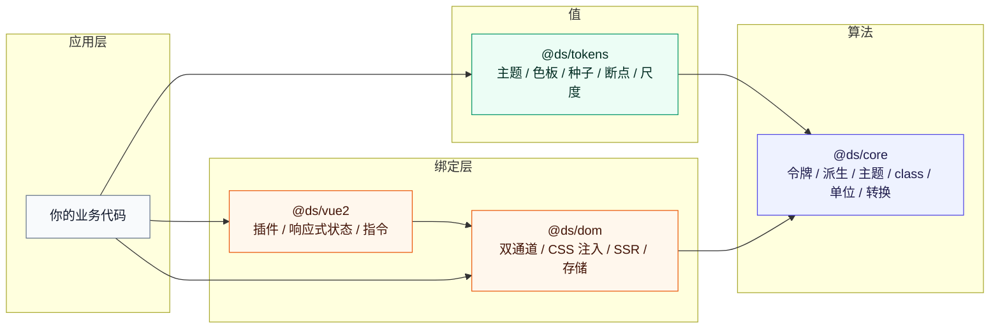
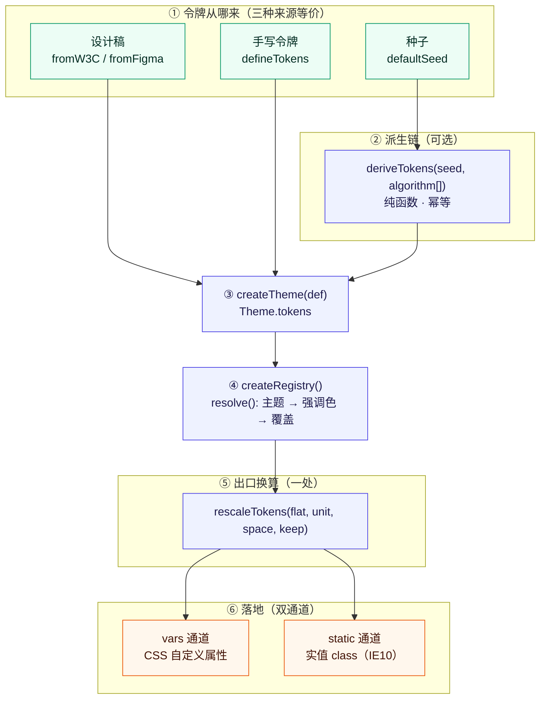
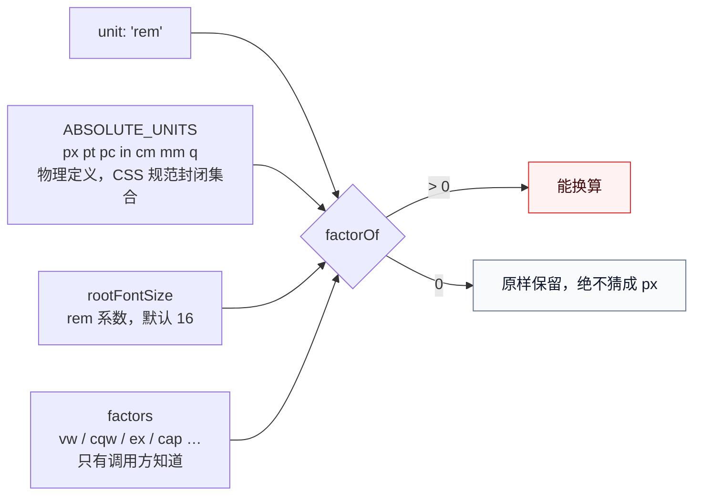
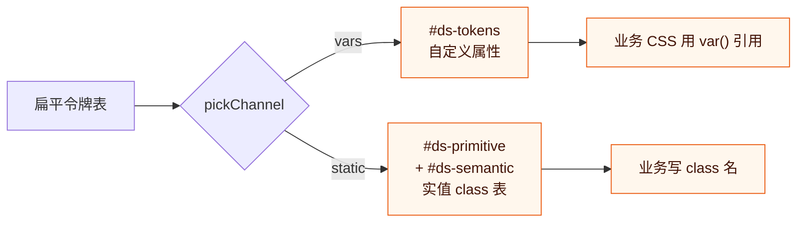
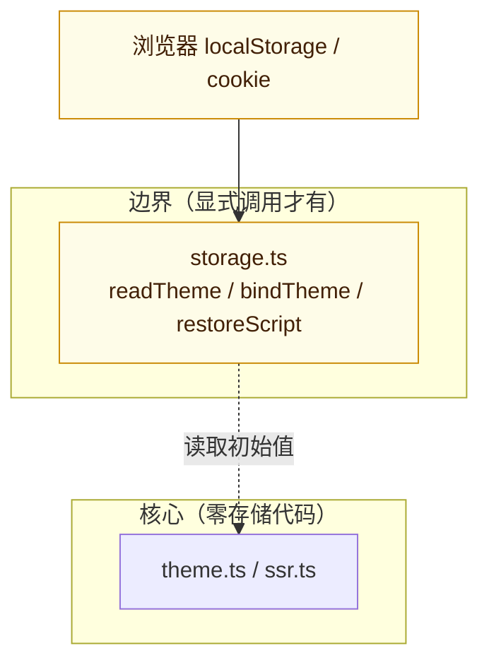
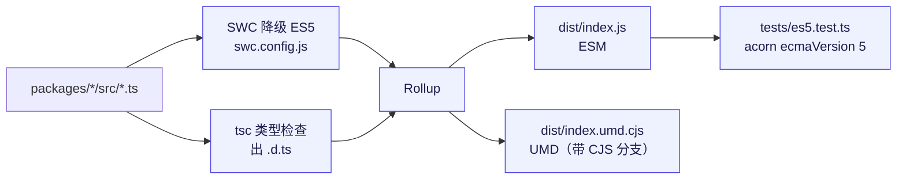

# ds-foundation 架构

> 一句话：**core 只有算法没有值，tokens 只有值没有算法**，dom / vue2 负责把两者接到具体运行环境上。

本文件讲四件事：包怎么分层、令牌怎么流动、单位怎么走、以及为什么这么分。
API 逐条的用法看 [README](../README.md)。

---

## 1. 包结构与依赖



依赖是**单向**的，且 `@ds/tokens` 与 `@ds/dom` 之间没有箭头 —— 意识到这点很重要：

| 包 | 入口 | 有没有 DOM | 有没有设计决策 | 能不能 SSR / 构建期跑 |
| --- | --- | --- | --- | --- |
| `@ds/core` | `packages/core/src/index.ts` | 无 | **无** | 能（纯函数） |
| `@ds/tokens` | `packages/tokens/src/index.ts` | 无 | **全是** | 能 |
| `@ds/dom` | `packages/dom/src/index.ts` | 有 | 注入形式上有（见 §6） | 只能出货字符串 |
| `@ds/vue2` | `packages/vue2/src/index.ts` | 间接依赖 dom | 无 | 不能 |

两条铁律：

1. **core 里不许出现具体色值、具体断点数字、具体尺度表。** 历史上一度有 `preset.ts`
   与一堆 `DEFAULT_*` 兜底，现已全部迁出。唯一的例外是 `DEFAULT_NS = 'ds'`（前缀兜底，
   前缀出错整张样式表都出不来，它属于「算法能不能跑」而不是「长什么样」）
   和 `DEFAULT_ROOT_FONT_SIZE = 16`（浏览器默认值，不是设计决策）。
2. **dom 不知道 tokens 存在。** 官方那两套主题是**参数**传进去的，不是 import 进来的。
   于是换一套设计语言不用改这两个包，只是换个入参。

### 与示例工程的关系

`examples/demo-app`（Vue 2 + Vite）与 `examples/uniappx`（uni-app x）**不在库的工作流里**
—— lint / typecheck / test 都不覆盖它们，它们是接线样例。它们通过别名指向
`packages/*/dist/index.js`（四个包都是 private + `workspace:`，装不进 node_modules），
所以改完库要重新 `pnpm build`。

---

## 2. 令牌数据流

令牌一辈子要走：**拾取 → 派生/合并 → 注册 → 单位换算 → 落地**。前两步在构建期做，
后三步每次换主题都要重做一回。



### ② 派生链

`Algorithm = (tokens, ctx) => TokenTree`，**入参与返回值同形**，所以能串联：

```js
deriveTokens(seed, [defaultAlgorithm, darkAlgorithm, compactAlgorithm], 'dark')
```

数组从左到右跑，前者输出是后者输入。`ctx` 带 `{ mode, input, rootFontSize }` ——
`input` 是管道开跑前的原始种子，后处理算法可以回看「用户最初的意图」而不是前面算法的产出。

官方三个算法：

| 算法 | 干什么 | 幂等？ |
| --- | --- | --- |
| `defaultAlgorithm` | 稀疏种子补全成完整令牌表 | 否（只跑一次） |
| `darkAlgorithm` | 明暗反转 | **是**（跑两次等于一次） |
| `compactAlgorithm` | 圆角 ×0.75、字号 −1px | 否 |

### ③ 合并优先级

```
theme.tokens  →  accent.tokens  →  overrides         （后者盖前者）
```

注意第二条是**覆盖不是派生**：改 `color-brand` 不会让 `color-brand-hover` 跟着动。
这正是「官方主题不含 brand 一族」的原因 —— 品牌色只由强调色提供，`accents: {}` 时
令牌表里就是没有 `color-brand`，不是缺漏。

> 合并只能深合并（`mergeTree`）。走 `unflattenTokens(mergeTokens(...))` 会让
> `color-brand` 与 `color-brand-hover` 抢同一个 `color.brand`，短键被冲掉。

---

## 3. 单位：这是全库唯一「横向」的管线

单位不是 `@ds/dom` 的一个 `{ unit: 'rem' }` 选项能概括的，它贯穿整条链，所以单列一节。

### 判据：集合会长大的，就不要手写它

跟 IE10 API 检查是同一条判据（那里用 compat 数据替代手写清单）：CSS 单位一直在长 ——
`dvh` / `cqw` / `cap` / `rlh` 都是近几年才有的。今天手写一份「认得的单位」，
明天就得为新单位回来改库。所以 `unit.ts` **没有认字清单**，只有一个系数查询：

```
factorOf(unit, space) -> 1 单位等于多少 px，查不到返回 0
```

系数的三条来源：



`0` 是「查不到」的意思，不是异常：调用方拿到 0 就该原样保留原值，不抛错也不重试。
把 `10vw` 当成 `10px` 算进去，比老实说「换不了」难查得多。

### 单位由「值」决定，不由开关决定

```js
// 第二个参数是换算上下文 UnitSpace：{ rootFontSize, fontSize, factors }
deriveTokens(remifyTree(defaultSeed, { rootFontSize: 16 }))   // 给 rem 种子出 rem
// font-size-md: 0.875rem
// font-size-sm: 0.75rem   ← 14px − 2px，差值也跟着折过去
```

不对 `deriveTokens` 加「我要 rem」开关：`sizeSm = sizeMd − 2` 的「2」是 **2px 语义的设计决策**，
开关一开，这个差值就不知道该折多少了。所以入口是「把种子换成别的单位写法」，
派生唯一跟单位有关的参数是 `rootFontSize` —— 它决定 2px 折成多少 rem
（root=16 → 0.125rem，root=10 → 0.2rem）。

### 为什么 dom 还要再来一层

因为**大部分令牌不过派生链**：官方那两套主题是手工挑的静态值，直接由 registry 拼进令牌表。
所以在出口（`currentFlat()`）统一换算一次 —— tokens() / get() / 注入的 CSS / SSR 导出四处口径一致。

`keepPx`（默认 `['border-width', 'shadow']`）是策略不是算法，所以挂在 dom 的入参上：
1px 边框跟着根字号缩放会变糊甚至消失；阴影是固定视觉深度，不属于排版尺度。

对应到 `ThemeManagerOptions`：`unit` 是 `UnitId`（任意单位符号，不只 `'px' | 'rem'`）、
`rootFontSize` 与 `factors` 一起组成 `UnitSpace`。想落地 vw / cqw 就把 `factors` 传进来；
不传的话这些值会原样保留 —— 换算发生在别处也一样，不存在「默认给个猜的视口宽度」。

---

## 4. 双通道：同一份令牌，两种落地方式

`@ds/dom` 在建 manager 时会按浏览器能力二选一：`pickChannel()` 返回 `'vars' | 'static'`。

| | vars 通道（现代浏览器） | static 通道（IE10） |
| --- | --- | --- |
| 注入形态 | `:root { --ds-color-brand: #4f46e5 }` | 实用类直接写实值 `.ds-bg-brand{background:#4f46e5}` |
| `get('color-brand')` | `var(--ds-color-brand)` | `#4f46e5` |
| 换主题代价 | 改一处变量 | 重新生成整张 class 表 |
| IE9 规则上限 | — | 4000 条一片（`splitCss`） |

**业务代码不需要知道自己活在哪个通道**：`ds.get()` / `ds.varName()` 已经把差别吃掉，
`ClassSheet` 也只是同一份 `rules` 的两种渲染。



---

## 5. 持久化与 SSR：刻意留在边界上



`createThemeManager` **没有 `persist` 选项**，这是刻意的 breaking：
一旦核心碰了存储，SSR 就可能拿到客户端才有的值。要持久化就显式绕一圈：

```js
const saved = readTheme()
const ds = createThemeManager({ ...baseOpts, theme: saved.theme || 'light' })
bindTheme(ds)     // 之后每次切换自动写回
ds.init()
```

SSR 侧用 `getInitScript({ restore: restoreScript() })` 内联一段同步恢复脚本，
避免首屏闪白。

---

## 6. 设计决策记录（为什么是这样）

按重要性排序，每条都对应一个「曾经踩过的坑」。

### A. 机制与值分开

`@ds/core` 删掉 `preset.ts`、删掉种子兜底、把必传参数一律改成**必传**
（编译期就红，而不是运行期静默补默认值）。反例记住：早期「accent 为空就套 indigo」
的兜底表现为「所有主题的品牌色一样」，因为 accent 盖在 theme.tokens 之上 —— 从界面上
完全看不出是兜底干的。**宁可抛错，不要替用户做设计决策。**

### B. 集合会长大的，就不用手写清单

同一条判据在三个地方落地：

| 要防的东西 | 做法 | 为什么不是清单 |
| --- | --- | --- |
| 非 ES5 语法 | `acorn.parse(code, { ecmaVersion: 5 })` | 不认识的特性一律算不合格，不存在「清单里没写所以放行」 |
| IE10 不支持的 API | `eslint-plugin-compat` + BCD 数据 | 数据会跟标准更新 |
| 认得的 CSS 单位 | `factorOf` 查系数 | 每年都有新单位 |

全仓库只剩 4 条 `no-restricted-syntax`（`for-of` / `yield` / `await` / `globalThis`），
它们是**降级之后才引入依赖**的东西 —— SWC 怎么降没有数据源记录，属工具盲区。

### C. 100% 覆盖率 ≠ 行为被验证

四项（statements / branches / functions / lines）全钉 100%，但这只是入场券。
踩过两次假测试后才定下：**用变异测试验守护强度** —— 故意改坏源码跑全量，
红 = 真守着，绿 = 形同虚设。

遇到覆盖不到的分支，先分清「没测到」还是「根本走不到」：

- 真没测到 → 补测试；
- 走不到 → **改代码**，不许写替身去凑。经典案例：`applySystemPreference` 里用
  `registry.getTheme(want)` 判「有没有这套主题」永远为真（getTheme 查不到会兜回当前主题），
  换成对 `listThemes()` 找名字。定式：**见到不可达分支先想是不是 API 语义用错了。**

### D. 必传参数的代价

`themes` / `accents` / `scales` / `rules` / `utilities` / `map` 现在全是必传，
`bootstrap(options)` 也必传。代价是所有调用点都得自己给，收益是不会有人
「忘了传、结果拿到别人的设计」。

---

## 7. 构建与兼容



- **IE10 是兼容基线**：产物必须纯净 ES5（脚本里一律 `var` / `function`），
  半透明色须逗号语法 `rgba(r, g, b, a)`，IE9 样式表规则上限 4095（按 4000 切片）。
- **TS 锁 6.0.3**：TS 7 是 Go 原生版，不提供 JS 编译器 API，typescript-eslint 8.70 启动即报错。
  升级的前置条件是 typescript-eslint 支持它。
- SWC 降级能力实测：let/const（含闭包 → `_loop` IIFE）、箭头、模板串、解构、展开、
  `?. ?? ||= **`、class/extends、getter、计算属性名、标签模板、`catch {}`、参数尾逗号 —— 全干净；
  **for-of / generator / async 不行**（依赖 Symbol 或 Promise）。

---

## 8. 验证入口

```bash
pnpm run verify        # typecheck → lint → build → coverage，顺序别改
node scripts/check-jsdoc.mjs        # 全部函数必须有中文描述 + @param + @returns
node scripts/convert-tokens.mjs <file> --unit=rem --root=16
```

`verify` 的顺序有讲究：**ES5 产物层的检查必须在 build 之后**（没 build 时那 6 个用例跳过，
属正常现象）。
